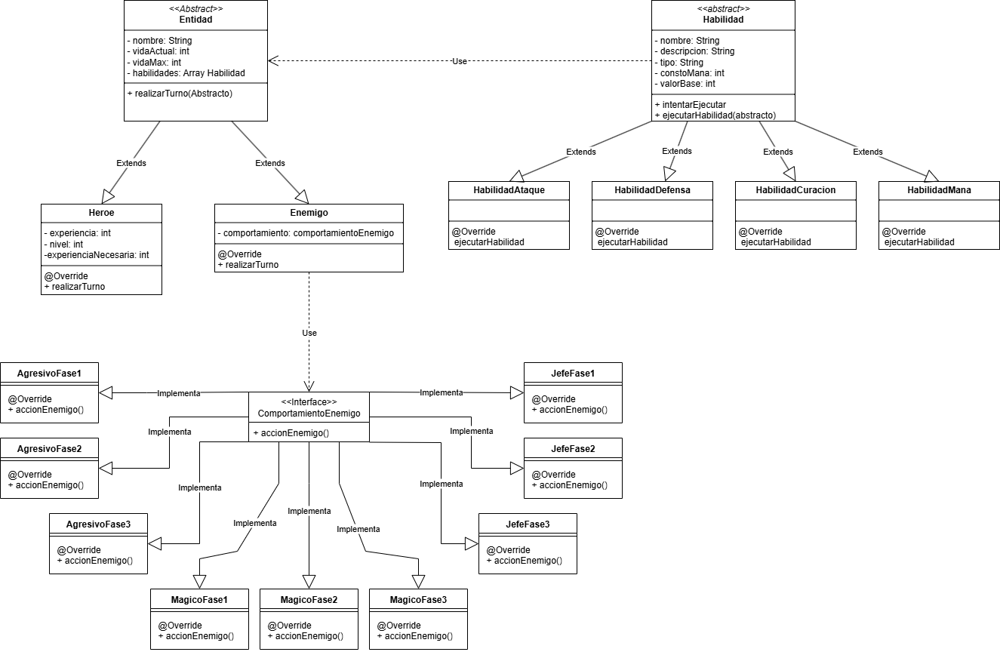
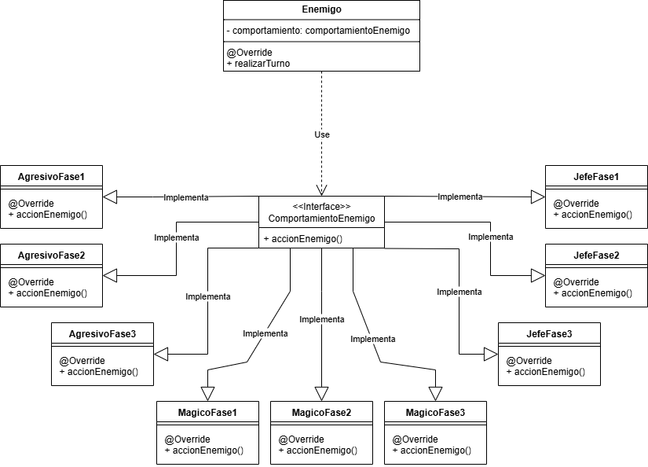
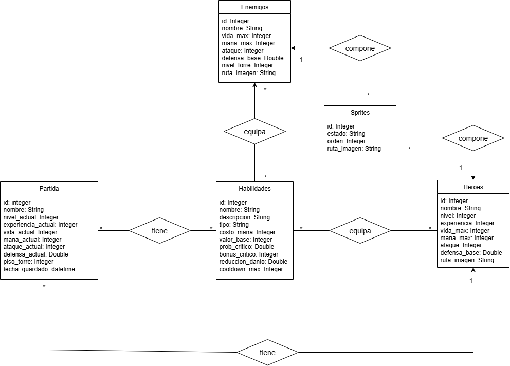

# Proyecto: Mortal Tower

## 1. Integrantes del equipo
- Almonacid, Maximiliano Andrés
- Caseres Marcos David
- Leal Isaac
- Sandoval Molina, Jordan David

## 2. Dominio y alcance del sistema

### Descripción del problema
Se busca desarrollar una aplicación de escritorio de un videojuego de rol por turnos con estructura de torre. El jugador elige un personaje inicial y debe avanzar a través de cinco niveles de dificultad creciente, enfrentando enemigos con comportamientos diferentes. En cada combate podrá atacar, defenderse o utilizar habilidades que consumen maná. Si el jugador muere, debe comenzar nuevamente desde el primer nivel pero no pierde la experiencia ni las habilidades ganadas. Tambien el juego tiene un sistema de autoguardado, cada vez que inicia el nivel guarda la partida de ese usuario. Si supera el quinto nivel y derrota al jefe final, gana el juego y se presentan los creditos finales. 

### Objetivo del sistema
El objetivo del sistema es ofrecer un juego funcional, modular y extensible que permita aplicar de forma clara los conceptos de Programación Orientada a Objetos. El diseño buscará representar correctamente personajes, enemigos, habilidades y combate por turnos, favoreciendo la reutilización de código, el polimorfismo y la separación de responsabilidades.

### Alcance
La primera versión del sistema incluirá:
- Selección inicial de personaje.
- Seleccion de partidas guardadas.
- Menu de opciones.
- Combate por turnos contra enemigos definidos según el nivel.
- Cinco niveles de torre.
- Nivel 1 con dificultad introductoria (el zombie herrero).
- Jefe final en el último nivel con la dificultad maxima.
- Elección entre recompensas al terminar cada combate.
- Sistema de habilidades con consumo de maná.
- Persistencia de partidas.

Quedarán fuera de alcance en esta versión:
- Historia.
- Inventario amplio de objetos.
- Tienda.
- Animaciones avanzadas.
- Otros personajes: Orco y arquero

### Funcionalidades principales (Features)

- *Selección de personaje jugable*
  - El jugador podrá elegir un personaje al comenzar la partida.
  - Los personajes disponibles serán: Mago o Caballero.
  - Cada uno tendrá atributos y estilo de juego diferentes.

- *Sistema de combate por turnos*
  - En cada turno el jugador y el enemigo podrán atacarse, defenderse o usar una habilidad de recuperar energia (vida) o mana.
  - El daño tendrá un componente aleatorio y posibilidad de golpe crítico.
  - La pelea termina cuando uno de los dos luchadores gana, es decir que por medio de sus ataques deja sin puntos de vida al otro.

- *Sistema de enemigos*
  - Los enemigos aparecerán según el nivel de la torre.
  - Existirán enemigos de tipo agresivo, magicos y el jefe.
  - Cada tipo de enemigo reaccionará de forma distinta ante el estado del combate.

- *Sistema de habilidades*
  - Cada clase tendrá habilidades exclusivas.
  - Al superar un nivel, el jugador podrá elegir una entre tres habilidades aleatorias que pueden ser de: defenza, ataque, recueperar energia o mana.
  - Las habilidades consumirán maná. Excepto la de recuperar mana.
  - El jugador podrá equipar hasta 4 habilidades ya sean para atacar o defenderse.
  - Si obtiene una nueva habilidad de una categoría completa, deberá decidir si conservar una anterior o reemplazarla.

- *Progresión*
  - La torre tendrá 5 niveles.
  - El primer nivel funcionará como introducción a las mecánicas.
  - Si el jugador muere, reiniciará desde el comienzo.
  - Si derrota al jefe final del nivel 5, ganará la partida.

- *Persistencia*
  - El sistema almacenará las estadisticas bases de las dinstintas entidades del juego(heroes y enemigos)
  - El sistema almacenará las habilidades correspondientes a cada entidad.
  - El sistema dispondra de guardado de partidas donde se puede almacenar hasta 5 de estas, cada partida se guardara al pasar de nivel en la torre, no se realizara el guardado automatico en medio de un combate.

## 3. Arquitectura y diseño

### Patrónes de diseño
- #### **MVC (Modelo-Vista-Controlador):** 
Separación estricta de las responsabilidades gráficas de la lógica del juego.
- #### *Patrón state:* 
  Implementado para definir la Inteligencia Artificial enemiga en tiempo de ejecución sin alterar para que este se comporte de distintas maneras.
  - *Interfaz:* Comportamiento Enemigo
  - *Contexto:* Enemigo
  - *Estados Concretos:*
    * ComportamientoAgresivoFase1: primera etapa con la que empieza el combate contra el Herrero Zombie y el Cuervo Sombrio, en esta fase el enemigo siempre intentara atacar con su mejor habilidad
    * ComportamientoAgresivoFase2: segunda etapa que se encontraran el Herrero Zombie y el Cuervo Sombrio comienza cuando el enemigo se encuentra a mitad de vida, aumentando su ataque y su defensa base.
    * ComportamientoAgresivoFase3: es la ultima etapa del Herrero Zombie y el Cuervo Sombrio, comienza cuando el enemigo se encuantra en su 30% de vida o menor a este, en esta fase aumenta un poco mas su ataque y su defensa base.
    * ComportamientoMagicoFase1: primera etapa con la que comienza el combate contra el Mago Oscuro y la Bruja Maltida, en esta fase los enemigos priorizan no quedar por debajo del 50% de mana, en caso de de contar con mas del 50% de mana si prioridad es atacar.
    * ComportamientoMagicoFase2: segunda etapa que se encontraran el Mago Oscuto y la Bruja Maldita una vez esten entre el 50% y 30% de vida, en esta fase los enemigos aumentan su defensa y recuperan un porcentaje de vida y mana, y su prioridad es atacar y luego recuperar mana cuando no poseen.
    * ComportamientoMagicoFase3: ultima etapa del Mago Oscuro y la Bruja Maldita, comienza cuando el enemigo se encuentra en su 30% de vida o menor a este, en esta fase pierden su defensa siendo mas receptivos a los daños, recuperan un porcentaje de vida y aumentan su ataque, y su prioridad es atacar y luego recuperar mana cuando no poseen
    * ComportamientoJefeFase1: primera etapa con la que comienza el combate contra el Jefe de la Torre, en esta fase el enemigo prioriza curarse, luego atacar y por ultimo recuperar mana.
    * ComportamientoJefeFase2: segunda etapa que se encuentra el Jefe de la Torre una vez este entre el 60% y 30% de vida, en esta fase el enemigo aumenta su defensa y recupera mana, y comienza a atacar con su habilidad menos fuerte para comenzar a desgastar al heroe.
    * ComportamientoJefeFase3: ultima etapa del Jefe de la Torre, comienza cuando el enemigo se encuentra en su 30% de vida o menor, en esta fase el enemigo pierde un poco de defensa pero aumenta su ataque, y prioriza atacar con su mejor habilidad de ataque, en caso que se encuentre con poca mana, recupera.
- **Patrón DAO:** Implementado para gestionar la persistencia del juego (guardado de partidas, cargar estadisticas, habilidades y enemigos) mediante SQLite. El objetivo principal es aislar el codigo SQL y la gestion de la base de datos de las logicas del Modelo y los Controladores. Se utilizan interfaces (EntidadDao y ObjetoDao) como contratos basicos para la recuperacion de datos. Esto asegura que todas las clases que las implementen cumplan con el contrato y permite que la escalabilidad del juego.
- **Patrón Singleton:** Este patrón se utiliza en la clase de GestorDeConexion, la clase posee un constructor privado por lo que ninguna clase puede crear nuevas conexiones, pero se provee un unico punto de acceso estatico mediante el metodo getInstancia(). Este metodo utiliza la palabra reservada synchronized, lo que lo hace seguro para los hilos. Esto garantiza que si el hilo grafico y el hilo secundario intentaran acceder a la base de datos al mismo tiempo, nunca se crearan dos conexiones simultaneas y no solo establece la conexion sino que ejecuta el metodo iniciarBD() (metodo para la creacion de tablas).
- **Implementacion de hilos:** El juego tiene un evento durante los combates en el cual un "Duende" pasa por pantalla para hacerle daño al heroe. Para lograr este evento en intervalos de tiempos sin interrumpir la interfaz grafica ni el Game Loop, se implemento un sistema de concurrencia mediante el uso de un hilo en segundo plano.
  * Hilo secundario(temporizador): La clase GoblinAtacante, la cual utiliza ScheduledExecutorService de la libreria de concurrencia de Java. Su responsabilidad es funcionar como un temporizador. Este hilo no procesa graficos, simplemente cuenta los segundos en un segundo plano.
  * Modelo: La clase Goblin encapsula todos sus atributos fisicos y posee un metodo actualizar(float delta) que calcula el desplazamiento de forma independiente.
  * Controlador y el Game Loop: La clase CombateScreen es la encargada de controlar este evento dentro del metodo render(), gerantizando que la actualizacion visual ocurra correctamente.
  * Comunicacion entre Hilos: Dado que LibGDX no permite modificar elementos visuales o de la partda desde un hilo secundario por motivos de seguridad de memoria, se implemento el metodo proveniente de la libreria de LibGDX llamado Gdx.app.postRunneable(). Cuando el ScheduledExecutorService cumple su intervalo de tiempo, no inyecta al duente directamente, sino que envia un mensaje (Runneable) a la cola de eventos del Game Loop

### Diagramas de diseño

### **Diagrama de clases UML (Conceptual)**

### **Diagrama de Patron State**

### **Esquema de Base de Datos**

## 4. Stack tecnológico
- **Lenguaje:** Java
- **IDE:** Visual Studio Code
- **Framework de IGU:** LibGDX
- *Base de datos:* SQLite
- **Control de Versiones:** Git y GitHub

